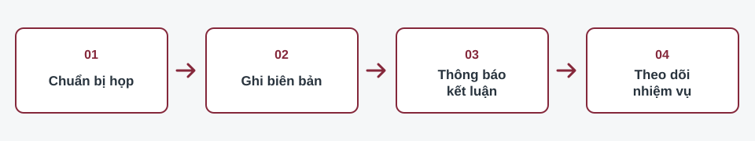

# Cẩm nang công tác họp của Văn phòng Đảng ủy xã

Cẩm nang giúp người làm công tác văn phòng tra cứu các bước từ chuẩn bị cuộc họp Thường trực Đảng ủy đến tổng hợp kết quả thực hiện kết luận. Mỗi bước có một đầu ra cụ thể và bảng kiểm để hạn chế bỏ sót việc.

> **Phạm vi sử dụng:** Đây là sản phẩm minh họa cho đồ án Nhập môn Công nghệ thông tin. Các biểu mẫu và tình huống sử dụng dữ liệu giả định; khi áp dụng thực tế phải đối chiếu quy chế làm việc, phân công nhiệm vụ và yêu cầu bảo vệ tài liệu của cơ quan.

## Bắt đầu từ công việc bạn đang làm

| Công việc cần làm | Trang cần xem | Sản phẩm sau bước này |
| --- | --- | --- |
| Chuẩn bị một cuộc họp | [Chuẩn bị cuộc họp](/chuan-bi-cuoc-hop.md) | Chương trình, tài liệu và danh sách dự họp |
| Ghi lại diễn biến, ý kiến và kết luận | [Ghi biên bản](/ghi-bien-ban.md) | Bản ghi đầy đủ để rà soát sau cuộc họp |
| Dự thảo văn bản giao việc | [Thông báo kết luận](/thong-bao-ket-luan.md) | Dự thảo xác định rõ việc, người phụ trách, thời hạn |
| Đôn đốc và tổng hợp kết quả | [Theo dõi nhiệm vụ](/theo-doi-nhiem-vu.md) | Bảng theo dõi và nội dung báo cáo tiến độ |

## Nguyên tắc dùng cẩm nang

1. Ghi đúng nội dung đã được chủ trì kết luận; ý kiến thảo luận chưa thành kết luận cần thể hiện riêng trong biên bản.
2. Mỗi nhiệm vụ trong thông báo nên xác định đầu mối chủ trì, sản phẩm cần nộp và mốc hoàn thành theo kết luận thực tế.
3. Lưu bản chính thức trong hệ thống hoặc nơi lưu trữ được cơ quan quy định. Website công khai này chỉ chứa hướng dẫn và ví dụ giả định.

## Khu vực tham khảo

Bản đồ dưới đây giúp người học hình dung địa bàn xã Tùng Lộc, Hà Tĩnh khi giới thiệu bối cảnh sử dụng cẩm nang. Bản đồ không dùng để xác định địa chỉ cơ quan hoặc địa điểm cuộc họp.

<iframe title="Bản đồ khu vực Tùng Lộc, Hà Tĩnh" src="https://www.google.com/maps?q=T%C3%B9ng%20L%E1%BB%99c%2C%20H%C3%A0%20T%C4%A9nh&output=embed" loading="lazy" referrerpolicy="no-referrer-when-downgrade" allowfullscreen></iframe>

[Bắt đầu với bước chuẩn bị cuộc họp](/chuan-bi-cuoc-hop.md)
